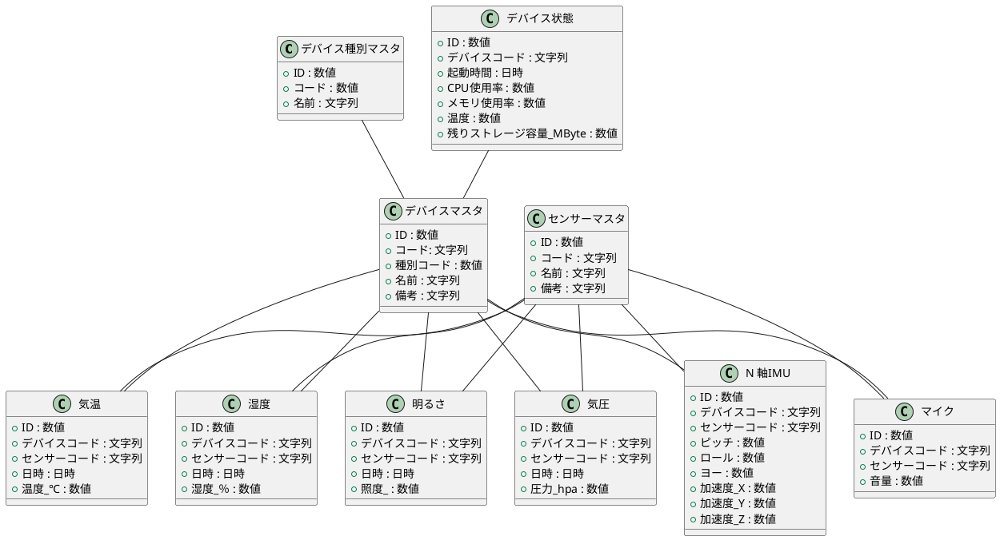

# Models

DB で管理するモデルを検討する

```plantuml
@startuml
class "デバイス種別マスタ" as device_type {
    +ID : 数値
    +コード : 数値
    +名前 : 文字列
}
class "デバイスマスタ" as device {
    +ID : 数値
    +コード: 文字列
    +種別コード : 数値
    +名前 : 文字列
    +備考 : 文字列
}
class "センサーマスタ" as sensor {
    +ID : 数値
    +コード : 文字列
    +名前 : 文字列
    +備考 : 文字列
}
class "デバイス状態" as device_state {
    +ID : 数値
    +デバイスコード : 文字列
    +起動時間 : 日時
    +CPU使用率 : 数値
    +メモリ使用率 : 数値
    +温度 : 数値
    +残りストレージ容量_MByte : 数値
}
class "気温" as temperature {
    +ID : 数値
    +デバイスコード : 文字列
    +センサーコード : 文字列
    +日時 : 日時
    +温度_℃ : 数値
}
class "湿度" as humidity {
    +ID : 数値
    +デバイスコード : 文字列
    +センサーコード : 文字列
    +日時 : 日時
    +湿度_％ : 数値
}
class "明るさ" as illuminance {
    +ID : 数値
    +デバイスコード : 文字列
    +センサーコード : 文字列
    +日時 : 日時
    +照度_ : 数値
}
class "気圧" as atmospheric_pressure {
    +ID : 数値
    +デバイスコード : 文字列
    +センサーコード : 文字列
    +日時 : 日時
    +圧力_hpa : 数値
}
class "N 軸IMU" as inertial_measurement_unit {
    +ID : 数値
    +デバイスコード : 文字列
    +センサーコード : 文字列
    +ピッチ : 数値
    +ロール : 数値
    +ヨー : 数値
    +加速度_X : 数値
    +加速度_Y : 数値
    +加速度_Z : 数値
}
class "マイク" as mic {
    +ID : 数値
    +デバイスコード : 文字列
    +センサーコード : 文字列
    +音量 : 数値
}

device_type -- device
device_state -- device
device -- temperature
device -- mic
device -- humidity
device -- inertial_measurement_unit
device -- atmospheric_pressure
device -- illuminance
sensor -- temperature
sensor -- mic
sensor -- humidity
sensor -- inertial_measurement_unit
sensor -- atmospheric_pressure
sensor -- illuminance
@enduml
```
